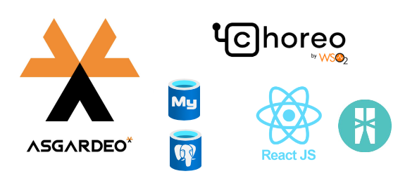
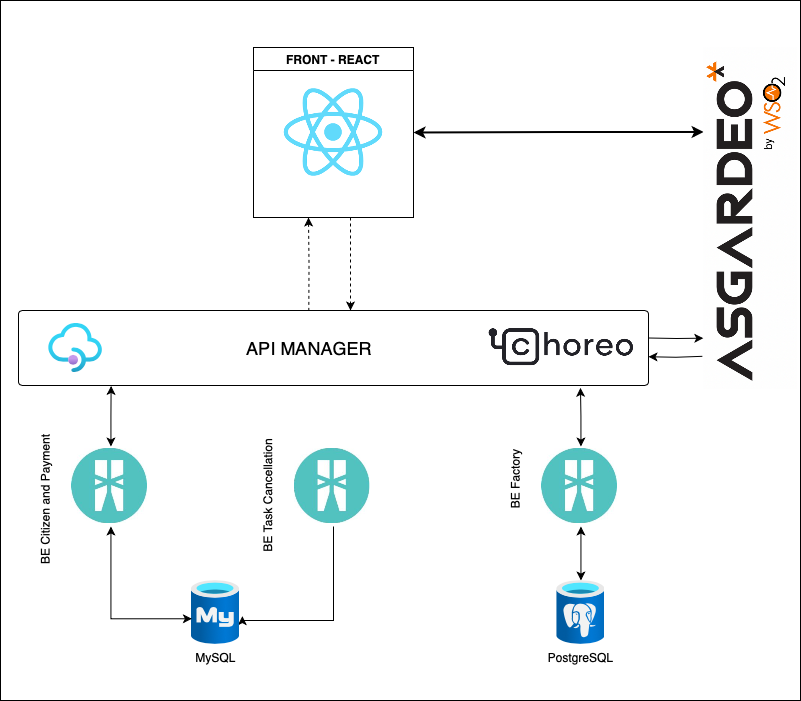
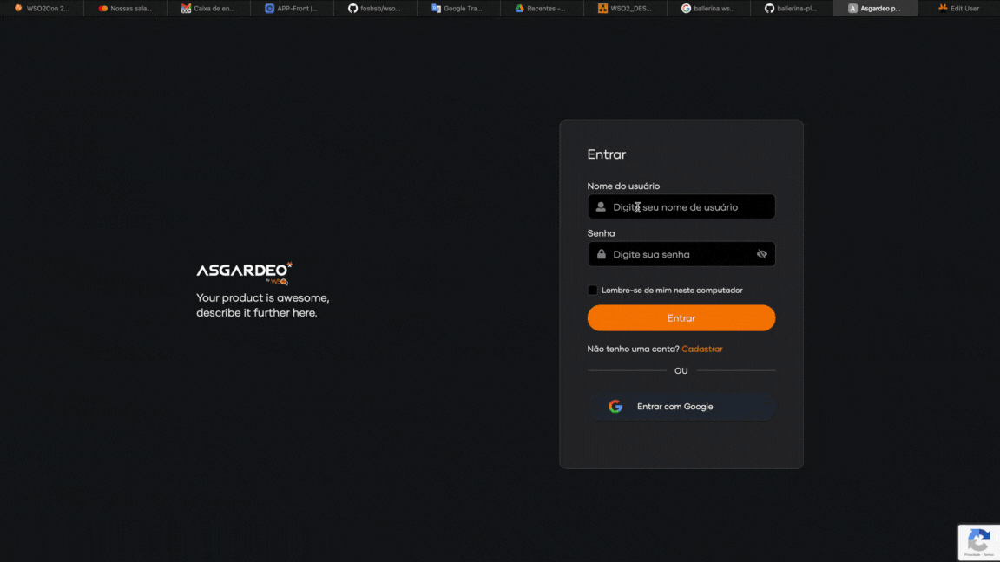
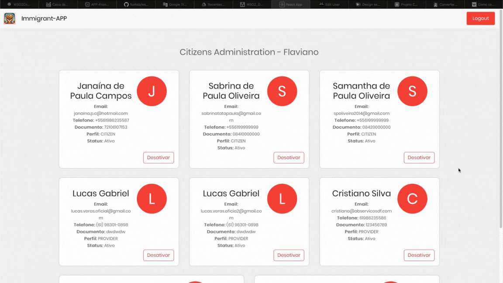
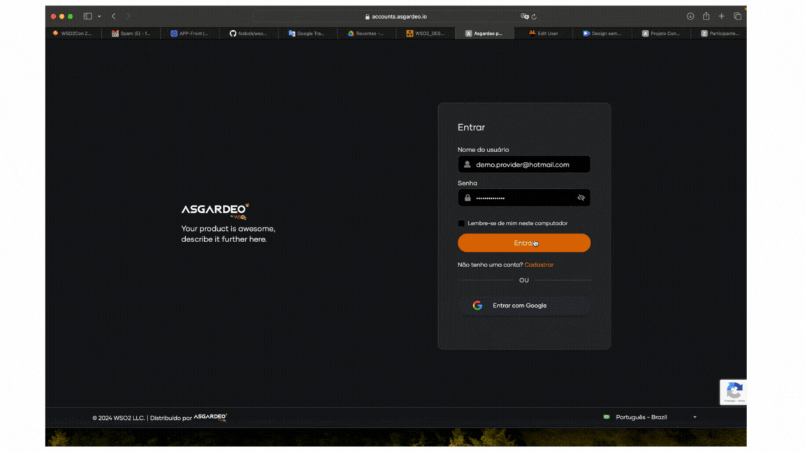
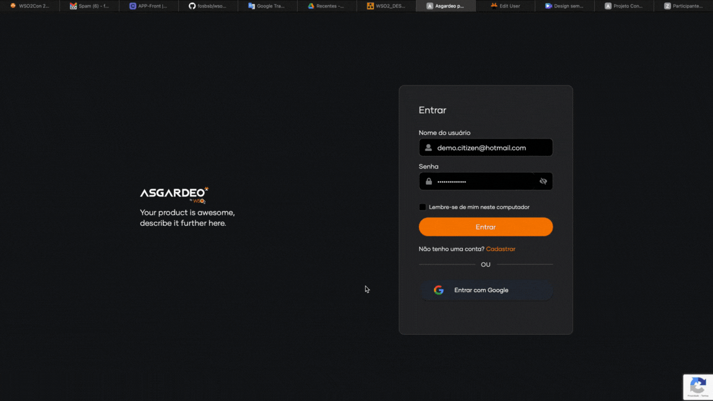

### Immigrant-APP
 

It is an application developed in React for the WSO2 Challenger 2024.

This application communicates with Asgardeo for SSO and Federation with Google.

Asgardeo is used to register new users and can also use federated login with Google.

And with three APIS:

- BE-Citizen with MySQL;
- ViaCep (Proxy API);
- BE-Factory with PostegreSQL.

As a Scheduled Task:

- BE-Task-Cacelled with MySQL

## Demo Utilization

URL APP: <https://app-fosbsb.choreoapps.dev>

The system was designed for addresses in Brazil, if you wish you can use some example zip codes (CEP) when registering:

70640515, 72130540, 70650515

**Admin:**

Responsible for activating and deactivating users and checking all registrations.

Username: `demo.admin@hotmail.com`
Password: `ch4ll3ng3rWSO2`

**Provider:**

Responsible for paying a citizen who wants to help, you can choose one or more citizens and provide a donation with payment via credit card.

Username: `demo.provider@hotmail.com`
Password: `ch4ll3ng3rWSO2`

**Citizen:**

Register on the platform and monitor donations received.

Username: `demo.citizen@hotmail.com`
Password: `ch4ll3ng3rWSO2`

### Features

## Register

The user must start the flow by creating a user in argadeo or logging in with a Google account.

After the first step, you need to complete the registration.

By default it will be recorded (inactive) and the administrator, via the Admin flow, can activate or deactivate it.

## Profile Admin

Users with an Admin profile can view the list of users and activate or deactivate them.

## Profile Provider

Provider users are responsible for making donations to citizens.

The provider chooses a citizen then creates a payment and enters the credit card amounts.

When sending, a Payment Gateway is called and returns whether it was approved or not.

If payment is not completed within 24 hours, the Task developed in Ballerina will cancel the payment.

## Profile Citizen

Citizens can view payments received as donations on their profile.

